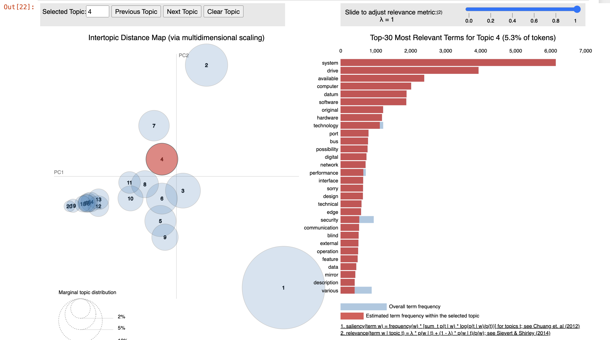

# Latent Dirichlet Allocation (LDA) Project
## Project Overview
This project was undertaken as part of research at Institut Élie Cartan in Nancy, France, from March to June 2021. The main objective of the project was to explore and apply the Latent Dirichlet Allocation (LDA) model for topic modeling on textual data. The work involved a comprehensive literature review, data preparation, and the application of LDA using the scikit-learn library in Python.

## Project Structure
The project is structured into several key parts:

### 1- Literature Review
Latent Dirichlet Allocation (LDA) is a generative statistical model used to discover abstract topics within a collection of documents. Introduced by David Blei, Andrew Ng, and Michael Jordan in 2003, LDA represents each document as a mixture of topics, where each topic is characterized by a distribution over words.

#### Core Concepts of LDA:

- **Document Representation:**
  - Documents are mixtures of topics, and topics are distributions over words.

- **Generative Process:**
  - For each document:
    1. Determine the number of words.
    2. Choose a topic distribution.
    3. For each word, select a topic and then a word from that topic's distribution.

- **Dirichlet Distribution:**
  - Used as a prior for the topic distributions across documents, controlling the sparsity of topics.

- **Parameter Estimation:**
  - Variational Inference and the Expectation-Maximization (EM) algorithm are commonly used to estimate the hidden variables (topic distributions and word distributions) in LDA. These methods infer the latent topic structure from the data.

### 2- Data Preparation
Cleaned and prepared textual data from two sources:
- The 20 Newsgroups dataset
- Novels by Albert Camus (The Rebel, The Misunderstanding, The Myth Of Sisyphus)

  

### 3- Application of LDA
Applied LDA using scikit-learn to extract significant topics from the datasets.
Evaluated the results to ensure coherence with the known themes of the documents.

## Results
### 20 Newsgroups Dataset
The LDA model successfully extracted significant topics from the 20 Newsgroups dataset. The topics identified were consistent with the newsgroup categories, indicating that the model was effective in distinguishing between different themes present in the dataset.

- **Topic 3**: Keywords such as "space," "mail," "science," and "research" indicate discussions related to space sciences and research, fitting well with the sci.space newsgroup category.

- **Topic 8**: Keywords like "problem," "sure," "book," and "law" suggest discussions related to troubleshooting and legal matters, aligning with topics discussed in the talk.politics.misc category, covering various political discussions including legal issues.

- **Topic 12**: Discussions around "system," "drive," "available," and "computer" suggest topics related to computer systems and hardware, accurately reflecting discussions in the comp.sys.ibm.pc.hardware newsgroup category.

These associations illustrate the diverse range of discussions within the 20 Newsgroups dataset and highlight the LDA model's capability to uncover meaningful topics from textual data.

  

### Albert Camus' Novels

The LDA model successfully uncovered significant themes from Albert Camus' novels, reflecting the profound subjects that define his literary works. Here are two exemplary topics that closely align with the themes explored in Camus' writings:

- **Topic 0**: Characterized by words such as "man," "absurd," "world," "reason," "time," and "history," this topic encapsulates the existential and philosophical essence central to Camus' exploration of the absurdity of human existence. It delves into the quest for individual freedom and meaning in a seemingly indifferent world, resonating deeply with Camus' philosophical reflections on rebellion against life's inherent absurdity. Here, individuals confront the contradictions and uncertainties of existence, embodying the struggle for personal significance and understanding.

- **Topic 2**: Represented by words like "history," "society," "artist," "revolutionary," "revolution," and "man," this topic correlates directly with Camus' philosophical reflections on art and the creative process. It highlights the artist's role in shaping perceptions of reality and fostering unity within a chaotic world. Additionally, this topic touches upon Camus' portrayal of rebellion as a creative act, challenging established norms and constructing new meanings amidst the chaos of human experience.

These topics underscore the LDA model's capability to discern and capture the intricate thematic elements pervasive throughout Albert Camus' novels, demonstrating its adeptness in analyzing and highlighting the philosophical and existential underpinnings that define his literary legacy.

 

## Conclusion
In this project, Latent Dirichlet Allocation (LDA) has proven effective in modeling topics across two distinct datasets. Specifically, in the 20 Newsgroups dataset, LDA successfully aligned topics with predefined newsgroup categories, demonstrating its robust ability to categorize diverse textual content accurately.

Moreover, when applied to Albert Camus' novels, LDA extracted significant themes such as absurdity, rebellion, and existentialism. These themes resonate deeply with the philosophical and existential underpinnings of Camus' works, illustrating LDA's capability to illuminate complex thematic elements within literary texts.

Overall, this project serves as a testament to the versatility and effectiveness of LDA in uncovering hidden thematic structures across different types of textual data. By providing a systematic approach to organizing and summarizing large collections of documents, LDA emerges as a valuable tool for researchers seeking deeper insights into the underlying themes and subject matter inherent in textual corpora.

## References
Blei, D. M., Ng, A. Y., & Jordan, M. I. (2003). Latent Dirichlet Allocation. Journal of Machine Learning Research, 3, 993-1022.
